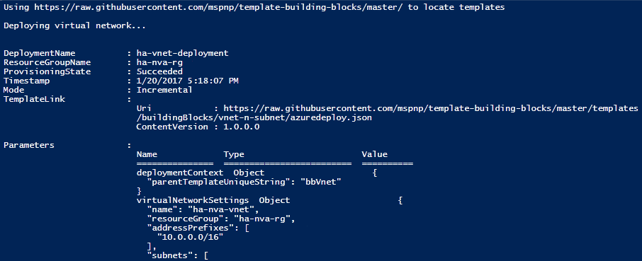
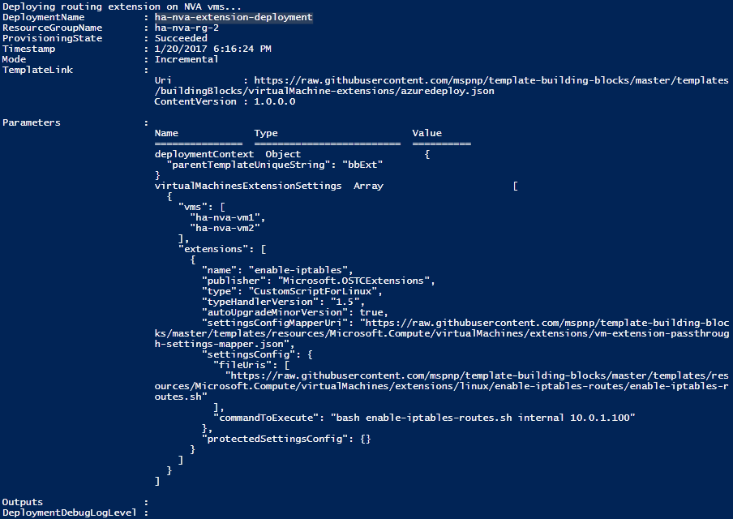
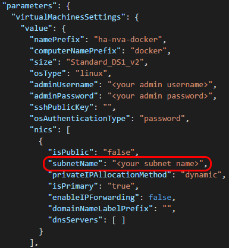
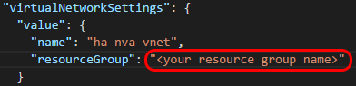
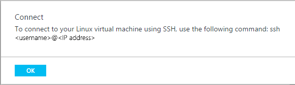
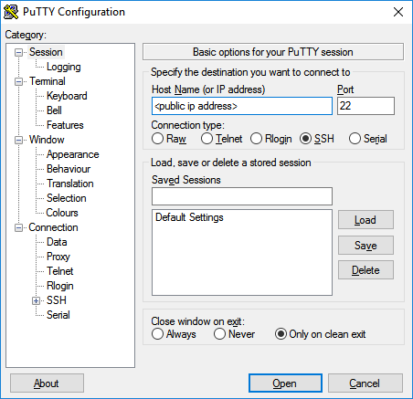
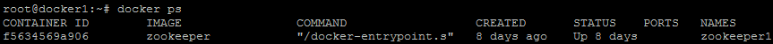
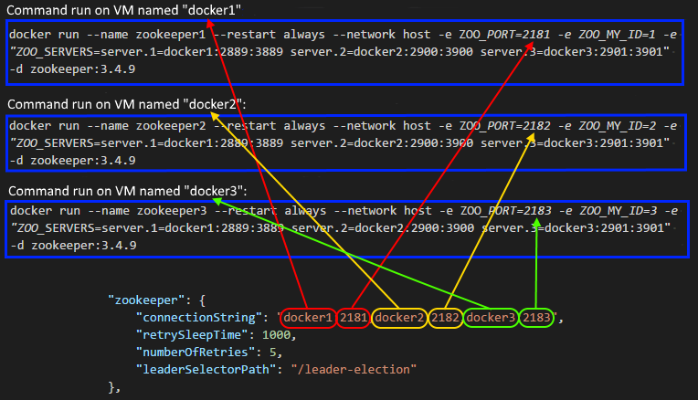
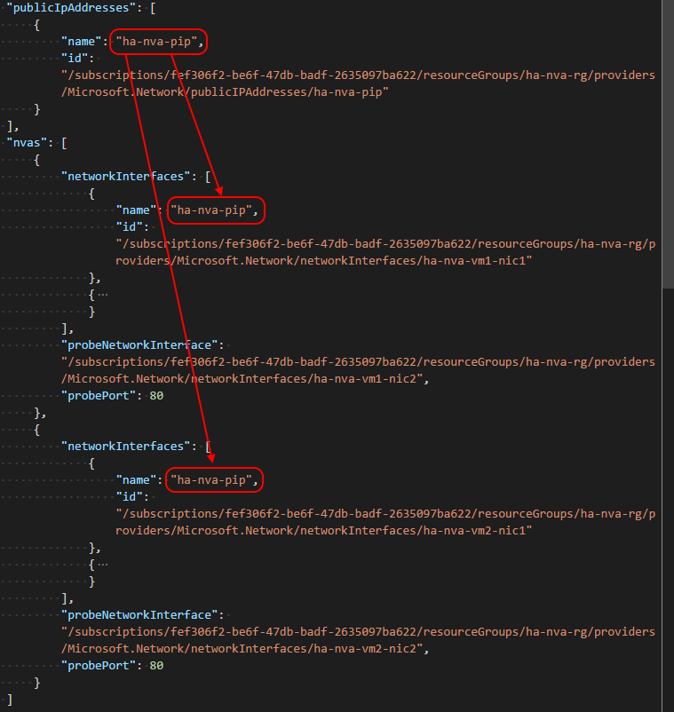
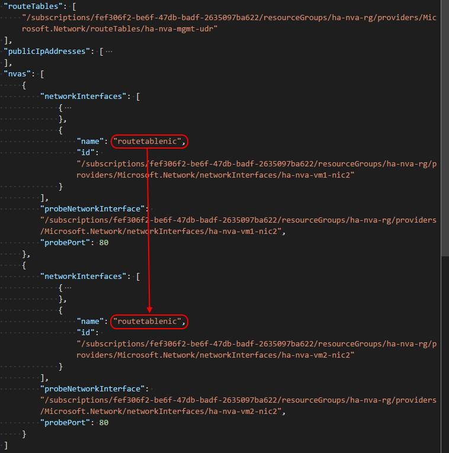

# High Availability NVA on Microsoft Azure

The Azure CAT Patterns and Practices team at Microsoft has created a solution to implement a high availability (HA) configuration for most types of network virtual appliance (NVA). The solution requires an active NVA and at least one backup NVA deployed in an availability set. An NVA monitor client continually probes the health of the active NVA. If the active NVA fails to respond to a health probe, the NVA monitor client modifies user defined routes (UDRs) to pass network traffic through the backup NVA and the backup NVA becomes the active NVA. The solution can also move the association of a public IP address from the failed NVA to the backup NVA if necessary.

The NVA monitor client is implemented as a [ZooKeeper][zookeeper-overview] client running in a [Docker][docker-overview] container. Multiple instances of the NVA monitor client execute in multiple VMs, but only one NVA monitor client is the "leader" at any one time. A ZooKeeper server ensemble runs in multiple Docker containers and provides concurrency and leader election for the NVA monitor client nodes. The NVA monitor client is able to make changes to the resources in your Azure subscription because it is an [Active Directory (AD) application](https://docs.microsoft.com/en-us/azure/azure-resource-manager/resource-group-create-service-principal-portal). 

If you do not have an existing Azure network environment and would like to test this solution, we have created a sample test environment that you can you use. If you have an existing Azure network enviroment with multiple NVAs, skip to the "deploying the HA NVA solution" section.

# Deploying the test environment


The test environment includes:
* a virtual network with four subnets.
    * an external DMZ subnet (10.0.0.64/27)
    * an internal DMZ subnet (10.0.0.96/27)
    * a web subnet for the web workload VMs (10.0.1.0/24)
    * a management subnet for the jumpbox (10.0.0.128/25)
* Three virtual machines (VMs) deployed with network interfaces (NICs) with an IP address in the web subnet.
    * Each VM is deployed with an extension to install Apache with a test HTML file (/var/www/htmldemo.html).
* An internal load balancer with an IP address in the web subnet. The internal load balancer distributes requests to the three web VMs.
* Two virtual machines each deployed with an extension to configure each VM as an [uncomplicated firewall][uncomplicated-firewall].
    * each NVA includes one NIC with an IP address in the external DMZ subnet and one NIC with an IP address in the internal DMZ subnet.
    * The active NVA is configured to forward traffic received on ports 80 and 443 to the IP address of the internal load balancer.
* A user defined route (UDR) with an entry in the route table to forward outbound requests from the three web tier VMs to the active NVA's primary NIC.
* a public IP (PIP) associated with one of the NVA NICs with an IP address in the external DMZ subnet. Initially the PIP is associated with the first NVA NIC, and this is the active NVA. The second NVA VM is the passive NVA.

> The template and parameter files used by this deployment are *not* standard Azure Resource Manager templates, they are [building block templates](https://github.com/mspnp/template-building-blocks) provided by the Azure CAT Patterns and Practices team at Microsoft. You can modify these parameter files to suit your needs by reviewing the readme files in the Github repository for the building block templates.

To deploy the test environment, follow these steps:

1. Either use Git to clone the [https://github.com/mspnp/ha-nva](https://github.com/mspnp/ha-nva) repository on your local machine, or download a zip of the files and extract them to a local directory.

    > If you have downloaded the Git repository in a zip file, you must set your Azure PowerShell execution policy to unrestricted using the following Windows PowerShell commandlet:
    > ```
    > Set-ExecutionPolicy -ExecutionPolicy Unrestricted
    > ```


2. In Windows Powershell, navigate to the `ha-nva/ha-nva-deployment/sample-test-environment` directory and execute the following command:

    ```powershell
    ./Deploy.ps1 <subscriptionID> <region>
    ```

    Substitute your Azure subscription ID for `<subscriptionID>` and a valid region for `<region>`.

3. If the deployment is progressing successfully, you will see output from the script similar to this:

    

4. You will see the following output from the script when the entire deployment is complete:

    

## Manually testing network route modification

The folder includes a pair of Powershell scripts (`MoveToNode1.ps1` and `MoveToNode2.ps1`) that you can use to manually test switching the association of the PIP and changing the next hop IP address of the UDR to the passive NVA. To test switching to the second NVA, follow these steps.

1. In the Azure portal, go to the `ha-nva-rg` resource group, click on `ha-nva-vm1`, then `network interfaces` (under `settings`) and make note of the private IP address for each NIC, `ha-nva-vm1-nic1` and `ha-nva-vm1-nic2`. Repeat the process for `ha-nva-vm2`. Next, click on the `ha-nva-pip` public IP address, click on `overview`, and make note of the NIC name in the `associated to` field. Finally, click on the `ha-nva-udr` UDR, click on `routes` (under `settings`) and make note of the `next hop` IP address.

2. In Windows Powershell, navigate to the `ha-nva/ha-nva-deployment/sample-test-environment` directory and execute the following command:

    ```powershell
    ./MoveToNode2.ps1
    ```

3. Return to the Azure portal and verify that the PIP has been associated with `ha-nva-vm2-nic1` and the `next hop` IP address of the UDR has been changed to the IP address of `ha-nva-vm2-nic2`.

To test switching to the first NVA, repeat step 1 above, and follow these steps:

1. In Windows Powershell, navigate to the `ha-nva/ha-nva-deployment/sample-test-environment` directory and execute the following command.

    ```powershell
    ./MoveToNode1.ps1
    ```

2. Return to the Azure portal and verify that the PIP has been associated with `ha-nva-vm1-nic1` and the `next hop` IP address of the UDR has been changed to the IP address of `ha-nva-vm1-nic2`.

# Deploying the HA NVA solution

This is a complex deployment and there are multiple steps that must be performed on multiple VMs. Before you begin, we strongly recommend that you read through these instructions completely to understand what is involved with each step of the deployment. 

Generally, the deployment has the following stages.

1. Deploy the docker VMs
2. Use SSH to log on to the docker VMs
3. Mount an Azure fileshare on each VM
4. Create the Azure service principal
5. Create the Docker image for the NVA monitor ZooKeeper client
6. Start the ZooKeeper server nodes on each docker VM
7. Edit the NVA monitor client configuration file
8. Start the NVA monitor client docker containers
9. Verify that the NVA monitor client containers are working

## Deploy the VMs that will host Docker and ZooKeeper

[Docker][docker-overview] is a container platform used here to simplify the deployment of the ZooKeeper server nodes and the ZooKeeper NVA monitor client nodes. [ZooKeeper][zookeeper-overview] is an open-source distributed coordination service that is used to provide high availbility for the NVA monitor clientnodes. 

A ZooKeeper ensemble requires at least three server nodes for quorum, and we recommend that each ZooKeeper server ensemble include an odd number of server nodes. We also recommended that at least three separate VMs be used to host ZooKeeper server nodes. You can either deploy the VMs manually or we have provided a script to deploy three VMs.

### Deploy the Docker VMs manually

If you deploy your own VMs, the host operating system must be Canonical Ubuntu Server 16.04 LTS. You must install [Docker Engine](https://docs.docker.com/engine/installation/linux/ubuntulinux/) on each of the VMs. 

### Deploy the Docker VMs using the PowerShell script

By default, the following script will deploy three VMs to a subnet named `dmz-internal` in a resource group named `ha-nva-rg`. If you deployed the sample environment above, the `dmz-internal` subnet and `ha-nva-rg` have been deployed.

> If you have an existing environment and want to change the subnet where the VMs will be deployed, navigate to the the `ha-nva/ha-nva-deployment/parameters` directory and edit the `ha-nva-docker.parameters.json` file. In the `virtualMachinesSettings` values is an array named `nics`: 
>
>
>
>Set the `subnetName` value to the name of your subnet.
>
>To change the resource group where the VMs will be deployed, change the `resourceGroup` value in the `virtualNetworkSettings` parameter:
>
>

To deploy the VMs, follow these steps:

1. In Windows Powershell, navigate to the `ha-nva/ha-nva-deployment` directory and execute the following command:

    ```powershell
    ./Deploy.ps1 <subscriptionID> <region> <resourceGroupName>
    ```
    Substitute your Azure subscription ID for `<subscriptionID>`, a valid region for `<region>`, and a new or existing resource group for `<resourceGroupName>`. If you previously deployed the test environment, you can omit this parameter, the VMs will deployed to the `ha-nva-rg` resource group by default.
    > If you are deploying to an existing resource group, you will be prompted to confirm that you want to update the existing resource group. Answer `yes` to update the existing resource group.

2. Wait for the deployment to complete.

## Use SSH to remotely log on to the Docker VMs

If you deployed the sample test environment earlier, the Docker VMs were not deployed with a PIP so you will not be able to remotely log on to them. However, a jumpbox named `ha-nva-jb-vm1` was deployed to the `mgmt` subnet that does have a PIP associated with it. You can remotely log on to this VM and use it to remotely log in to the Docker VMs.

To remotely log on to the jumpbox, click on the `ha-nva-jb-vm1` VM in the Azure portal, and then click on the `Connect` button. A dialog box is displayed that says:



If you're connecting from a Linux OS, enter this command in the command line of your Linux OS. You will be connected to the VM and prompted to log on to the machine.

If you're connecting from Windows, there is no SSH client installed. However, you can download an SSH client named [PuTTY](http://www.chiark.greenend.org.uk/~sgtatham/putty/download.html) to SSH to the `ha-nva-jb-vm1` jumpbox. To connect to your jumpbox, start the PuTTY application:



Enter the public IP address of your jumpbox from the `Connect` dialog box above and click the `"Open"` button to connect. Once you are connected to the VM, you will be prompted to log on to the machine.

## Mount an Azure Storage Account fileshare on each VM

The HA NVA monitor client requires several files to be present on each VM where it will be started. One way of sharing files between the VMs is to presistently mount an Azure fileshare to each of the VMs. An Azure fileshare will allow you to place files in the fileshare from any web browser, as well as mount the Azure fileshare in both Windows and Linux.

If you do not already have an existing fileshare, you can create one by following these steps:

1. In the Azure portal, select the storage account where you want to create the fileshare.
2. Click on "overview", then click on "files" in the "services" section.
3. In the "File Service" blade, click "+" to create a new fileshare.
4. Enter a name for the fileshare in the `"Name"` box, enter the maximum size (in MB) you require for the fileshare in the `"Quota"` box, and then click create. If you will only be using this fileshare to share these files necessary for this solution, you can set it to a relatively small size such as 100MB.
5. Click the `"Create"` button. 

To mount the Azure fileshare in each of the Docker VMs, SSH to each VM and follow these steps:

1. Create a new mount point for the mounted fileshare. For example:

    ```
    sudo mkdir /media/azurefileshare
    ```

2. Create a file to securely store the credentials that will be used by the OS to mount the fileshare and open it for editing. For example:

    ```
    sudo mkdir /usr/credentials
    sudo vi /usr/credentials/afscredentials
    ```

    The file requires two lines: `username=` and `password=`. Set `username=` to your storage account name, and `password=` to one of the access keys for the fileshare. These keys are available in the "Access Keys" blade of the storage account. For example:

    ```
    username=<storage account name>
    password=<fileshare access key>
    ```

    If you are in `vi`, type a colon `:` and then `wq` to save the file. Next, restrict permissions on the file with the following command:

    ```
    chmod 600 /usr/credentials/afscredentials
    ```

3. Edit the `/etc/fstab` file:

    ```
    sudo vi /etc/fstab
    ```

    Add a line to this file as follows:

    ```
    //<storage account name>.file.core.windows.net/<fileshare name> <mount point created in step 1> cifs vers=3.0,credentials=<path to credentials file created at step 2>,dir_mode=0777,file_mode=0777 0 0
    ```

    Replace `<storage account name>` with the name of your storage account, and replace `<fileshare name>` with the name of your file share. If you are in `vi`, type a colon `:` and then `wq` to save the file.

4. Mount the fileshare with the following command:

    ```
    sudo mount -a
    ```

> If you want to remove the fileshare from this persistent mount point, edit the `/etc/fstab` and remove the line added in step three. 

## Create the Azure AD service principal and application object

You can either create the Azure AD service principal and application object manually or we have created bash scripts to do this for you. 

If you want to create the service principal and application object manually, we suggest you read the ["use portal to create AD application and service principal that can access resources" document](https://docs.microsoft.com/azure/azure-resource-manager/resource-group-create-service-principal-portal).

If you want to use the bash scripts that we have created, please read the [bash script documentation](./ha-nva-deployment/ha-nva-create-service-principal.md).

> Note that you can either create the service principal with a certificate or with a password. This will affect the structure of the the NVA monitor client JSON configuration file that you will be editing in a later section.

## Create the Docker image for the NVA monitor ZooKeeper client

You will now create the Docker image for the NVA monitor. This image must be stored on each VM that will run the NVA monitor. You can either build the Docker image once on one VM, save it to the fileshare you created earlier, and copy it locally to each VM, or, you can build it locally on each VM.

To build the Docker image:

1. Create a new directory in your Linux VM. Create an `images` and `build` directory within the new directory.
    ```
    sudo mkdir images
    sudo mkdir build 
    ```

2. Copy the following files from Github to the new directory you created in step 1:
    ```
    sudo wget https://raw.githubusercontent.com/mspnp/ha-nva/master/docker/nva/images/nva-docker-entrypoint.sh
    sudo wget https://raw.githubusercontent.com/mspnp/ha-nva/master/docker/nva/images/mvn-entrypoint.sh
    sudo wget https://raw.githubusercontent.com/mspnp/ha-nva/master/docker/nva/images/settings-docker.xml
    ```

3. Copy the following files from Github to the `\images` directory you created in step 1:
    ```
    cd images
    sudo wget https://raw.githubusercontent.com/mspnp/ha-nva/master/docker/nva/images/nvaimagebuild
    sudo wget https://raw.githubusercontent.com/mspnp/ha-nva/master/docker/nva/images/nvaimagealpine
    ```

4. Go back to the new directory and build the Docker image that will build the NVA monitor binaries:
    ```
    cd ..
    sudo docker build -t nvaimagebuild:1 -f images/nvaimagebuild .
    ```
    You *must* copy the docker build command exactly *including the period (.) at the end*.

5. Run the Docker container you just created to build the NVA monitor binaries. 
    ```
    docker run -it --rm -v <full path to build folder created above>:/ha-nva-master/nvadaemon-assembly/target/full nvaimagebuild:1
    ```

6. Build the NVA client monitor Docker image:
    ```
    docker build -t nvaimagealpine:3  --build-arg=SRC="build" --build-arg=DST="/nvabin" -f images/nvaimagealpine .
    ```
    You *must* copy the docker build command exactly *including the period (.) at the end*.

At this point, you can move on and repeat the steps on each VM that will run an NVA monitor daemon. Or, you can save the NVA client monitor Docker image created in step 6 to the file share and load it to each VM. To do this, follow these steps:

1. Save the NVA client monitor Docker image created in step 6 to your file share:
    ```
    sudo docker save nvaimagealpine:3 > /media/azurefileshare/nvaimagealpine3.tar
    ```
    If you have the fileshare mounted at a different location, substitute your path:
    ```
    sudo docker save nvaimagealpine:3 > <fileshare path>/nvaimagealpine3.tar
    ```

2. SSH to each of the other VMs and load the Docker image.

    ```
    sudo docker load < /media/azurefileshare/nvaimagealpine3.tar
    ```
    If you have the fileshare mounted at a different location, substitute your path:
    ```
    sudo docker load < <fileshare path>/nvaimagealpine3.tar
    ```

## Start the ZooKeeper server docker containers on each VM

Each of the three Docker VMs will run at least one ZooKeeper server Docker container. 

On each of the three Docker VM, start a ZooKeeper server container using the following command:

```
sudo docker run --name <name for docker container> --restart always --network host -e ZOO_PORT=<port number> -e ZOO_MY_ID=<unique integer ID of ZooKeeper server in ensemble> -e "ZOO_SERVERS=server.<ID>=<logical name of host or IP address>.2889.3889 server.<ID>=<logical name of host or IP address>.2900.3900 server.<ID>=<logical name of host or IP address>.2901.3901 -d zookeeper:3.4.9
```

The `--name` parameter must be unique across the ZooKeeper server ensemble running on all three Docker VMs. The `ZOO_PORT=` parameter must be a unique port number on a single Docker VM, but can be reused on other Docker VMs.

> Note that these two parameters make up the name:value pair in the comma delimited string of the `connectionString` value in the `zookeeper` parameters of the configuration file in the next section.

The `ZOO_SERVERS` parameter is a space delimited list identifying the other ZooKeeper server nodes in the ensemble. `"server."` (include the period) is a token that does not change, but the integer that follows references the `ZOO_MY_ID` parameter. This token and ID are set to the logical name or IP address of the VM running the Docker container, followed by the ZooKeeper follower port and the ZooKeeper leader election port.

The following is a typical command to start the first Docker server container on the first Docker VM: 

 ```
 sudo docker run --name zookeeper1 --restart always --network host -e ZOO_PORT=2181 -e ZOO_MY_ID=1 -e "ZOO_SERVERS=server.1=docker1:2889:3889 server.2=docker2:2900:3900 server.3=docker3:2901:3901" -d zookeeper:3.4.9
 ```

The following could be executed on the second Docker VM to start the second ZooKeeper server node, and assumes the logical name of this VM is `docker2`:

```
sudo docker run --name zookeeper2 --restart always --network host -e ZOO_PORT=2182 -e ZOO_MY_ID=2 -e "ZOO_SERVERS=server.1=docker1:2889:3889 server.2=docker2:2900:3900 server.3=docker3:2901:3901" -d zookeeper:3.4.9
```
The following could be executed on the third Docker VM to start the third ZooKeeper server node, and assumes the logical name of this VM is `docker3`:

```
sudo docker run --name zookeeper3 --restart always --network host -e ZOO_PORT=2183 -e ZOO_MY_ID=3 -e "ZOO_SERVERS=server.1=docker1:2889:3889 server.2=docker2:2900:3900 server.3=docker3:2901:3901" -d zookeeper:3.4.9
```

On each VM, verify the docker container is running by executing the following command.

```
sudo docker ps
```

If the zookeeper container is running correctly, you will see the following output.



The `CONTAINER ID` uniquely identifies the docker container. The `NAMES` column is the name created with the `--name` parameter. 

## Edit the NVA monitor client configuration file and copy to the fileshare

The NVA monitor client configuration file is passed to the Docker image when the Docker container is started. Any file editor can be used to edit this file. You can edit this file on a machine external to Azure and upload it to the Azure fileshare that is connected to the mounted volume in each of the VM or you can edit it on one of the Docker VMs and save it to the mounted fileshare so it can be used on the other Docker VMs.

A template JSON file is [available in Github](https://raw.githubusercontent.com/mspnp/ha-nva/master/ha-nva-deployment/scripts/nvadaemon-remote.json). Copy this file locally and open it with your preferred text editor.

> The `nvadaemon-remote.json` file includes passwords used by the NVA monitor client to make changes in your Azure subscription. Protect these secrets by storing this parameter file in a secure location with restricted acccess. 

There are two main sections in the NVA monitor client configuration file: `zookeeper` and `daemon`. 

### ZooKeeper section

The `zookeeper` section includes parameters to specify the settings for the ZooKeeper cluster.

The `connectionString` parameter is a comma delimited list referencing the ZooKeeper server nodes in the ensemble. Each element in the comma delimited list is in the form of `<logical name OR IP address of ZooKeeper VM>:<client port>`.

For example, if you started the ZooKeeper server docker containers using the commands from above, the `connectionString` parameter would be constructed from the following values:



The `retrySleepTime` parameter is an integer value that specifies the time, in milliseconds, a follower instance of the NVA client monitor client initiate a heartbeat connection to a ZooKeeper server.

The `numberOfRetries` parameter is an integer value that specifies the number of times a client instance will retry a failed heartbeat connection to a ZooKeeper server.

The `leaderSelectionPath` parameter is a string that specifies an identifier of a path in the ZooKeeper server cluster that is used by each NVA monitor client for concurrency. 

### Daemon section

The `daemon` section includes parameters to specify the configuration of the ZooKeeper NVA client monitor. This section has two top-level parameters. The `shutdownAwaitTime` parameter specifies <>. The `monitors` array includes several parameters to configure each ZooKeeper NVA client monitor.

The `monitorClass` parameter specifies the namespace of the client code that executes on the NVA client monitor.

The `settings` parameter includes several sub-parameters:
* The `azure` sub-parameter includes a number of settings:
    * `subscriptionId` specifies your subscriptionId. 
    * `servicePrincipal` specifies settings for the Azure AD application:
        * `clientId` specifies the Azure AD application ID.
        * `tenantId` specifies your Azure tenant ID.
        * The `clientCertificate` section specifies parameters for the certificates associated with the Azure AD application. This section includes one of two sets of parameters based on how the Azure AD service principal was created:
        * Use the first set of parameters if the service principal was created *with a certificate*.
        * `keyStorePath` specifies the path to the Java KeyStore *in the Docker container*. If you are using the default ZooKeeper NVA client monitor image, this value is `/nvabin/nva.jks`.
        * Use the following parameters if you created the Azure AD service principal with a certificate:
            * `keyStorePassword` specifies the Java KeyStore password.
            * `certificatePassword` specifies the password for the certificate.
        * Use the following parameters if you created the Azure AD service principal with a password:
            * `clientSecret` specifies the password for the service principal.
    * The `probeConnectTimeout` is an integer ands specifies the number of millisecond the client will wait after initiating a socket connection the NVA before classifying the socket connection as a failure.
    * The `routeTables` section is an array of strings that specify the name of the UDRs that will be modified by the client. *You must include the full path to the name of the UDR resource*. This is available in the "Properties" blade of the UDR resource in the Azure Portal.

        ```
        "routeTables": [
        "/subscriptions/xxxxxxxx-xxxx-xxxx-xxxx-xxxxxxxxxxxx/resourceGroups/ha-nva-rg/providers/Microsoft.Network/routeTables/ha-nva-udr",
        "/subscriptions/xxxxxxxx-xxxx-xxxx-xxxx-xxxxxxxxxxxx/resourceGroups/ha-nva-rg/providers/Microsoft.Network/routeTables/ha-nva-gateway-udr"
        ],
        ```

        * `publicIpAddresses` is an array of parameter objects that specify the public IP resources that are associated with the NVA NICs.
            * `name` is an indentifer you create that will be used as a reference in other sections of this configuration file. 
            * `id` is the name of the Azure PIP resource. Note again that you must include the full path to the name of the PIP resource. This is available in the "Properties" blade of the PIP resource in the Azure Portal.

            ```
            "publicIpAddresses": [
                {
                    "name": "nic1",
                    "id": "/subscriptions/xxxxxxxx-xxxx-xxxx-xxxx-xxxxxxxxxxxx/resourceGroups/ha-nva-rg/providers/Microsoft.Network/publicIPAddresses/ha-nva-pip    
                }
            ],
            ```

        * `nvas` is an array of parameter objects that specify properties for the NICs used by the NVAs. Each NVA's information is specified in a separate element of this array:
            * `networkInterfaces` is an array the specifies each of the NICs used by the NVA:
                * `name` specifies an identifer to indicate the group of NICs this NIC belongs to. If this NIC is the NIC associated with the PIP, this is the `name` identifier that you created in the `publicIpAddresses` section. For example, if you used the identifier `ha-nva-pip` for the `name` property in the `publicIpAddresses` section:
                                
                If this NIC has the IP address of the next hop in a UDR that was specified in the `routetables` section, create a unique identifier for the NICs that will be part of the UDR update. *At least one of these NICs must be the "next hop" IP address for a UDR specified in the `routeTables` section. The NVA monitor client associates the IP address in the "next hop" of the UDR with IP address of a NIC specified here, and then associates the NICs together using the `name` token specified here.*
                                
                * `id` specfies the name of the Azure NIC resource. As earlier, this must be the full path the name of the NIC resource.
            * `probeNetworkInterface` specfies the name of the Azure NIC resource that will be probed by the monitor client and responds to socket connection attempts to indicate the health of the NVA. Again, this is the full path the Azure NIC resource.
            * `probePort` specifies the port number that the NIC above will respond to socket connections on, indicating the health of the NVA. If a socket connection fails on this port, the NVA monitor client will consider it a failure and will retry the number of times specified in the `numberOfFailuresThreshold` property before initiating the PIP and UDR route switch.

            ```
            "nvas": [
            {
                "networkInterfaces": [...
                ],
                "probeNetworkInterface": "/subscriptions/xxxxxxxx-xxxx-xxxx-xxxx-xxxxxxxxxxxx/resourceGroups/ha-nva-rg/providers/Microsoft.Network/networkInterfaces/ha-nva-vm1-nic2",
                "probePort": <port number>
            },
            ```

When you have completed the configuration file, save it and upload it to the Azure fileshare created earlier so it can be copied to each of the VMs.

## Start the NVA monitor client Docker containers

You will now start the Docker container for the NVA client monitor that you copied from the fileshare earlier. You will also need to copy the configuration file and nva.jks certificate to a local directory. 

The Docker container requires a log4j.properties file to specify the settings for logging on the NVA monitor client Docker container. For more information on how to create a log4j.properties file, see the [Apache Log4j 2 FAQ](http://logging.apache.org/log4j/2.x/index.html). We have provided a log4j.properties file that you can use, copy it to each VM with the following command:

```
sudo wget https://raw.githubusercontent.com/mspnp/ha-nva/master/nvadaemon/src/main/resources/log4j.properties
```

To start the NVA monitor client container, execute the following command:

```
sudo docker run --name clientMonitor1 --restart always --network host -v /<name of local directory>/nvadaemon-remote.json:/nvabin/nvadaemon-remote.json -v /<name of local directory>/nva.jks:/nvabin/nva.jks -v <name of local directory>/log4j.properties:/nvabin/log4j.properties -d nvaimagealpine:3
```

You can start an NVA monitor client container on each of the Docker VMs. You should have at least 3 containers, one on each Docker VM, and we recommend that you run more than one container on each VM. 

### Verify the NVA monitor client

To make sure the monitoring client is working, follow the steps below:

1. Execute the following command on the VM:

    ```
    sudo docker logs <container_name> -f
    ```

    The command below shows the log for a continer named `clientMonitor1`.

    ```
    sudo docker logs clientMonitor1 -f
    ```

    If `clientMonitor1` is the leader, and working correctly, the output log will contain entries simliar to these:

    ```
    2016-12-15 22:21:10,266 DEBUG [pool-5-thread-1:NvaMonitor$MonitorCallable@95] - Waiting on signal
    2016-12-15 22:21:10,266 DEBUG [pool-5-thread-1:NvaMonitor$ScheduledMonitorCallable@56] - ScheduledMonitorCallable.await()
    2016-12-15 22:21:10,892 DEBUG [main-SendThread(10.0.0.102:2181):ClientCnxn$SendThread@742] - Got ping response for sessionid: 0x159033b46170000 after 0ms
    2016-12-15 22:21:13,267 DEBUG [pool-5-thread-1:NvaMonitor$ScheduledMonitorCallable@58] - Probe waiting time elapsed.  Looping
    2016-12-15 22:21:13,268 DEBUG [pool-5-thread-1:NvaMonitor$ScheduledMonitorCallable@66] - ScheduledMonitorCallable.await() complete
    ```

2. Repeat step 1 for other containers. If the container is not the leader, the output will contain entries similar to these:

    ```
    2016-12-15 22:20:33,996 DEBUG [main-SendThread(10.0.0.102:2183):ClientCnxn$SendThread@742] - Got ping response for sessionid: 0x359033b4a610000 after 0ms 
    2016-12-15 22:20:47,339 DEBUG [main-SendThread(10.0.0.102:2183):ClientCnxn$SendThread@742] - Got ping response for sessionid: 0x359033b4a610000 after 0ms
    2016-12-15 22:21:00,687 DEBUG [main-SendThread(10.0.0.102:2183):ClientCnxn$SendThread@742] - Got ping response for sessionid: 0x359033b4a610000 after 1ms
    2016-12-15 22:21:14,034 DEBUG [main-SendThread(10.0.0.102:2183):ClientCnxn$SendThread@742] - Got ping response for sessionid: 0x359033b4a610000 after 0ms    
    ```

### Troubleshooting the NVA monitor client

The NVA monitor client Docker container will continuously restart if the NVA monitor client fails to start correctly. Check the Docker logs for the container using the following command:

```
sudo docker logs <container_name> -f
```

If the logs show an exception on startup due to the NVA monitor client not being able to parse the configuration file, the most likely problem is either a malformed JSON file *or* the `name` properties in the `nics` section are not consistent. Review the configuration file and double check that you have specified the same identifier in the `name` property for the NICs associated with the PIP and the NICs associated with the UDR. 

<!-- links -->

[docker-overview]:https://www.docker.com
[uncomplicated-firewall]:https://wiki.ubuntu.com/UncomplicatedFirewall
[zookeeper-overview]:https://zookeeper.apache.org/doc/r3.1.2/zookeeperOver.html
